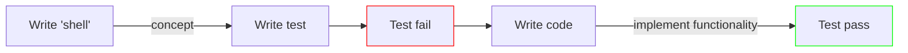

# TDD-Approach

## Sundae - Client
>
> Backdrop to test

- complex user interactions, form entry, order phases.
- mouseover popup, element disappears from DOM
- simulate server response, mock server response
- async app updates, awaiting DOM changes
- global state via context

- [ ] inProgress phase
- [ ] review phase
- [ ] completed

---

## React Testing Library vs Jest (Vitest)

- RTL provides ways to manipulate and examine simulated DOM
- Jest/Vitest are test runners, only difference is config setup. And few advanced syntax differences.

## TDD Approach

1. Write test before writing code
    - then write code according to "spec" set by tests
2. _Red-Green_ testing
    - Write function shell, then write a test and fail, then write minimal code to make this pass.
3. Refactor and clean up the code
    - Apply coding practices and principles.



## Types of tests

- Unit test - tests one unit of code in isolation
- Integration test - multiple unit works together
- Functional test - test the behavior of multiple units workflow

## Testing Library and Accessibility

- screen finds the elements by [Accessibility and their role](https://www.w3.org/TR/wai-aria/#role_definitions)
- The recommended queries to test with can be found [here](https://testing-library.com/docs/queries/about#priority).

## Run test in watch mode

```sh
npm test --watch
```

## How this project was created

This project was created using this command:

```sh
npm create vite@latest TDD-Approach --template react
```

and then following all of the steps below.

## Install React Boostrap, Vitest, and React Testing Library

```sh
npm install -D vitest @vitest/ui eslint-plugin-vitest
npm install -D jsdom @testing-library/jest-dom @testing-library/react eslint-plugin-jest-dom eslint-plugin-testing-library
npm install bootstrap react-bootstrap
```

## Add Bootstrap

Add this line to _src/main.jsx_:

```js
import "bootstrap/dist/css/bootstrap.min.css";
```

## Update port to 3000

To match the expectation of the sundae server, and avoid CORS errors, add this to the property / value to the `defineConfig` argument in _vite.config.js_:

```js
  server: {
    port: 3000,
    // exit if port 3000 is in use (to avoid CORS errors; server expects port 3000)
    strict: true,
  },
```

## Add `start` script to package.json

In order to match the legacy course videos (which were filmed with create-react-app), add this to the _package.json_ `scripts` array:

```json
    "start": "vite",
```

## Install future dependencies

For folks using this as a starter for adding React code, run these installs:

```sh
npm install -D @testing-library/user-event msw
npm install axios
```

## Add test script to package.json `test` object

```json
  "test": "vitest --watch"
```

## Add a test setup file

To make [jest-dom matchers](https://github.com/testing-library/jest-dom#custom-matchers) available in all test files:

1. create new file _src/setupTests.js_
1. add these contents:

```js
import "@testing-library/jest-dom";
```

## Add Vitest and Testing Library plugins to ESLint

In _.eslintrc.cjs_:

1. Add these to to the `extends` array:

```js
   'plugin:testing-library/react',
   'plugin:vitest/recommended',
```

1. This step avoids linting errors when using the `test` and `expect` Vitest globals without importing them first.

At the top, require the Vitest plugin:

```js
const vitest = require("eslint-plugin-vitest");
```

Then Add this property / value to the top-level `module.exports` object:

```js
    globals: {
      ...vitest.environments.env.globals,
    },
```

## Update a few ESLint rules

Add these to the `rules` array in _.eslintrc.cjs_:

```js
    "no-unused-vars": "warn", // warning, not error
    "vitest/expect-expect": "off", // eliminate distracting red squiggles while writing tests
    "react/prop-types": "off", // turn off props validation
```

## Add Automatic ESLint and Prettier formatting on save

1. Install [ESLint](https://marketplace.visualstudio.com/items?itemName=dbaeumer.vscode-eslint) and [Prettier](https://marketplace.visualstudio.com/items?itemName=esbenp.prettier-vscode) extensions in VSCode if they're not already installed.
1. Create _.vscode/settings.json_ file.
1. Add these contents:

```json
{
  "editor.codeActionsOnSave": {
    "source.fixAll.eslint": true
  },
  "editor.defaultFormatter": "esbenp.prettier-vscode",
  "editor.formatOnSave": true
}
```

**Note**: if you're having issues getting ESLint to work properly with VSCode, please see [this troubleshooting guide](https://dev.to/bonnie/eslint-prettier-and-vscode-troubleshooting-ljh).

## Update vite configuration for tests

Update _vite.config.js_ based on the [Vitest Testing Library example](https://github.com/vitest-dev/vitest/blob/main/examples/react-testing-lib/vite.config.ts). Add this property / value to the `defineConfig` argument:

```js
  test: {
    globals: true,
    environment: "jsdom",
    // this points to the setup file created earlier
    setupFiles: "./test/setup.js",
    // you might want to disable it, if you don't have tests that rely on CSS
    // since parsing CSS is slow
    css: true,
  },
```

## Command to run tests in watch mode

```sh
npm test
```

## Reference

- [creating a Vite project](https://vitejs.dev/guide/#scaffolding-your-first-vite-project)
- [Vitest Testing Library example](https://github.com/vitest-dev/vitest/tree/main/examples/react-testing-lib)
- [Vitest ESLint plugin](https://www.npmjs.com/package/eslint-plugin-vitest)
